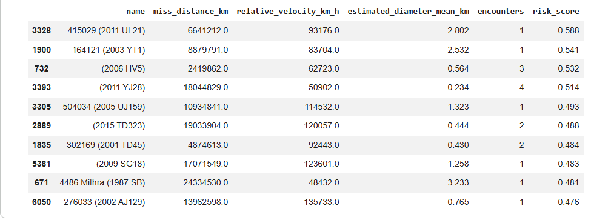
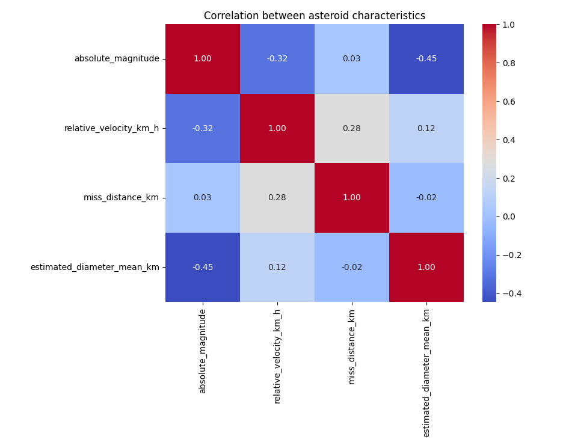
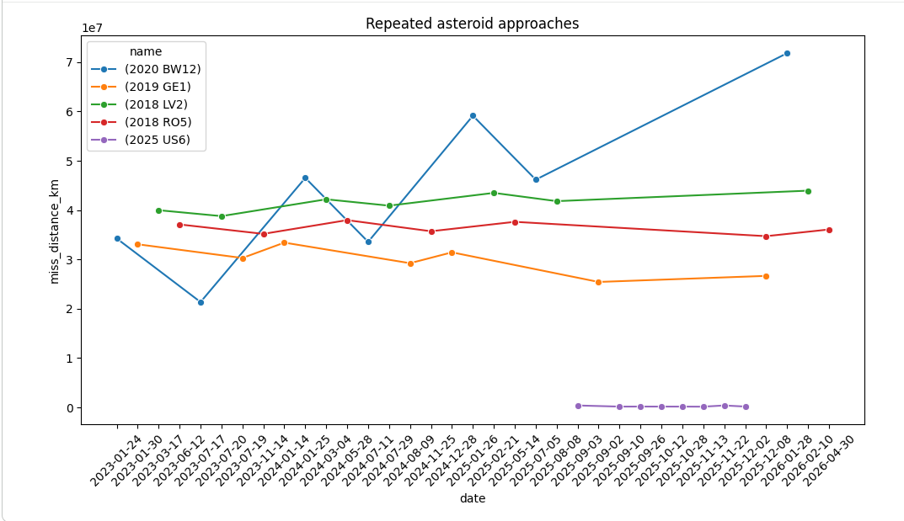
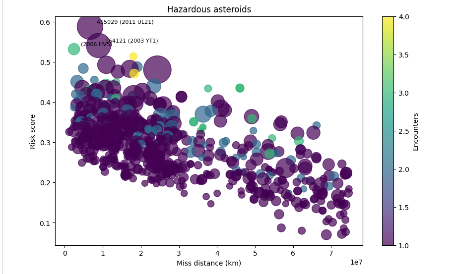

# nasa-asteroids-analysis
Analysis of near-Earth asteroids based on NASA API data, including hazard filtering, risk scoring and visualization.

Проєкт присвячений аналізу навколоземних астероїдів на основі відкритих даних NASA API.

## Мета проєкту
Дослідити потенційно небезпечні астероїди та побудувати простий рейтинг ризику на основі:
- дистанції зближення із Землею;
- швидкості руху;
- оцінного діаметра;
- кількості повторних зближень.
  
## Інструменти
- Python
- Pandas
- Matplotlib
- Seaborn
- NASA API
  
## Основні етапи аналізу
- завантаження та обробка JSON-даних із NASA API;
- нормалізація вкладених структур;
- фільтрація потенційно небезпечних астероїдів;
- аналіз повторних зближень;
- побудова спрощеного risk score;
- візуалізація результатів.

## Основні висновки

- Найбільші астероїди не завжди мають найвищий risk score.
   
- Розмір астероїда має слабку кореляцію зі швидкістю та absolute magnitude.
  
  - Для частини астероїдів спостерігаються повторні зближення із Землею на різній дистанції.
  
- Найбільший вплив на risk score у межах моделі мала дистанція зближення.
  

## Результат
У результаті аналізу було визначено астероїди з найвищим risk score та досліджено взаємозв’язок між дистанцією зближення, швидкістю, розміром і частотою повторних наближень.
\* Проєкт має дослідницький та навчальний характер. Побудований risk score не є науковою фізичною моделлю оцінки ризику зіткнення.
